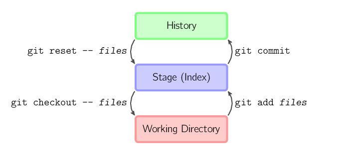

## ** get **Git** Instructions here **

_______
## Конспект находится в Readme.md

**repository** — хранилище — место, где хранятся и поддерживаются какие-либо данные

# **Схема работы базовая**

## **Команды MarkDown** >
git init file name.txt / .md - создание репозитория

git add fileName.txt - добавляет файл к отслеживаемым

git commit -m "YourComment"// пишем свой комментарий для добавленного файла

git status - покажет статус, создан ли файл, изменен, удален

git diff - показывает разницу, что +, что -

git log - инфо обо всех сохраненных версиях с коммитами - Журнал. Выбрать на какую версию откатиться

git checkout - выбор сохраненной версии с разными изменениями 4 цифры (из инфо по git log)

# header
## header
### header  

**~~fjhkjblilhlаррпррмли б трплои тро~~**
* git config --global user.name - после чего вводим «Ваше имя английскими буквами» в кавычках

* git config --global user.email - после чего вводим "ваша почта@example.com"

Переключение между коммитами checkout  - возвращаемся к сохранениям по их номеру.

 * *git checkout* - переключение между коммитами

 как **переключение** между **сохранениями** в играх )))

 * *git checkout **master** * - последнее "сохранение" 
  
 